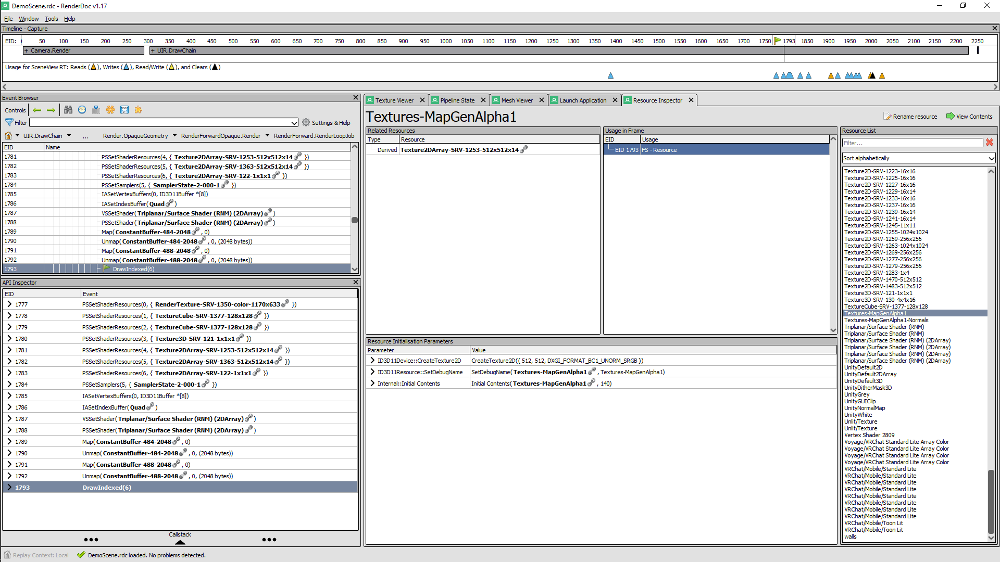
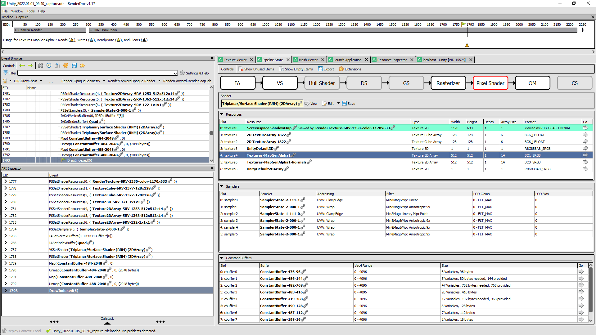
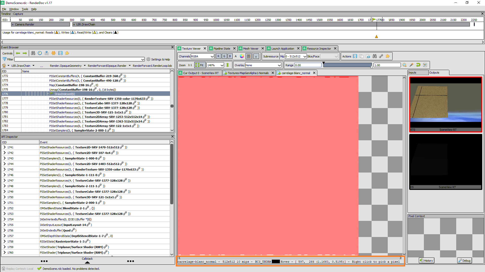
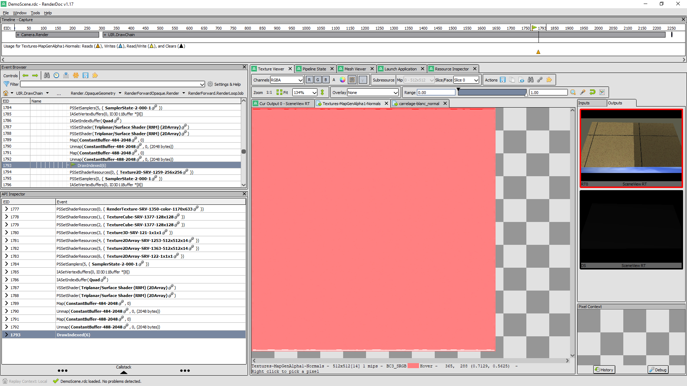

# Normals and TexArray

I recently was able to solve an issue where converting normals
textures into a texture array, would cause these textures to
not behave correctly with `UnpackNormal` in shaders.

So, now, I'm generating texture array using the following code :

```csharp
Texture2D modelTexture = textures[0];
int texturesCount = textures.Length;

string modelTexturePath = AssetDatabase.GetAssetPath(modelTexture);
TextureImporter importer = AssetImporter.GetAtPath(modelTexturePath) as TextureImporter;

TextureCreationFlags flags = 
    (modelTexture.mipmapCount > 1 ? 
        TextureCreationFlags.MipChain :
        TextureCreationFlags.None);

Texture2DArray array = new Texture2DArray(
    modelTexture.width, modelTexture.height, texturesCount,
    modelTexture.graphicsFormat,
    flags);
```

This ensures that the texture created have exactly the same
pixel format, which was one of the main reason why the textures
behaved incorrectly when used as normals.  
Some textures were generated as SRGB instead of UNORM, and
vice-versa.

A second issue also happened, where the 2DArray version of
a shader would look darker than the 2D version.  
It turned out to be a Unity bug :  
https://forum.unity.com/threads/default-2darray-is-always-grey.1120441/

Basically, in shaders, you can define a default "color"
keyword to texture properties.  
When doing this, if you do not set a texture to that
property slot, Unity will generate a 1-pixel wide texture,
where the pixel will have the same "color".  
However, while it does that for `2D` textures, for `2DArray`
textures it will always generate a "grey" one-pixel
`Texture2DArray` instead.  
So, in my case, while both the 2D and 2DArray versions of the
shader wanted a "white" default texture for the Occlusion
maps, the 2D version received a "white" texture while the
2DArray received a "grey" texture, leading to the `2DArray`
version looking darker.

There's no actual solution beside "just generating a default
`color` texture" and using it in this slot, if you want something
else than "grey" for the color, or, I guess, just have multiple
variants of the same shader using `ifdef`, then define a color
property and use it as the pixel value, if no texture is currently
set on the property.  
I haven't tested that last solution though.

## How did I got there ?

### The not working version

So, beforehand, I generated the whole `Texture2DArray` using the following
function :

```csharp
Texture2DArray array = new Texture2DArray(
    modelTexture.width, modelTexture.height,
    texturesCount, modelTexture.format, true);
```

This clearly didn't work well. I tried multiple configurations, but
in the end they all kind-of failed for reasons I didn't understand.

Since the "Texture information" panel from Unity wasn't really
informative, I decided that I'd have to use a Shader Debugger to
get to the end of this.  
I previously used **RenderDoc** a few times, and was impressed by the
quality of this debugger, so I figured I'd try to use it again for
this issue.

### Getting RenderDoc

Renderdoc is rather easy to get and install. Just go on :

https://renderdoc.org/

Then, for Windows users, just download the Windows version, install
it, run it and you're good to go.

### Interfacing it with Unity

Then came the question "Okay... so, now, how do I use it with my Unity
scene... ?".

This actually proved to be extremely simple, since Unity detects
RenderDoc when is installed, and actually provides additional buttons
to connect the current scene to RenderDoc, as stated in the official
documentation :

https://docs.unity3d.com/Manual/RenderDocIntegration.html

So, to interfacing RenderDoc with a Unity scene in the editor, is
basically done like this :

* Right-click on the "Scene" or "Game" tab in the editor and select :  
  **Load RenderDoc**  
* Launch RenderDoc, and open the menu :  
  **File > Attach to Running Instance**  
* In the "Remote Host Manager" window that just opened, select
  **Unity** and click on `Connect to App`.  

Then, to transmit the rendering information of a single frame to
RenderDoc, from Unity, just click on the "RenderDoc" button at the
beginning of the right part of the Scene toolbar.

After doing that, a photo of the current scene appears in RenderDoc
"localhost" tab.  
Double-clicking on this photo loads up all the rendering calls
information.  
That's where the fun begins.

  
  
  
  


### Getting the right information

Then came the question "... Alright, where do I get the my
texture information ?"

This took me a little while to figure out, since RenderDoc has
data for anything that happened inside the scene.  
So, in my case, I have multiple things on the scene (Skyboxes,
rendering camera, ...). And just looking at the "Texture Viewer"
while randomly browsing the Event Browser didn't lead me far.

However, looking at the "Resource inspector", I discovered that
RenderDoc had all the names of the all the elements in my scenes.  
Which actually include the name of the objects, the shaders and
the textures used !

Shaders information are not useful directly, though you can use
them as filters inside the "Event Browser" panel, which will lead
you to the right draw calls very quickly.  
This is the way I used the first time.  
However, it turns out that you can also access the same draw call
information quickly by selecting the 2DArray Texture name inside
the "Resource Inspector" and then double-clicking the EID reference
in "Usage in Frame".

Either way, since my two quads are next to each other, the draw
calls were actually next to each other too, which helped me
tremendously.

So, after double-clicking the "DrawIndexed" event inside the
"Event Browser", clicking on "Pipeline State" and then
"Pixel Shader" allowed me to get the list of the textures used
inside these draw calls.  
To differentiate the draw calls of the right and wrong shader,
just look at the **Shader** field inside the **Pipeline State**
or look at the argument of `VSSetShader` call before the `DrawIndexed`
call.




### Texture comparisons

**Pipeline State** → **Pixel Shader** presents the list of the bound
textures, and it's possible to view each individual texture information
by clicking on the right arrow in the **Go** column, at the right of
its name.

Doing that will open a new sub-tab inside **Texture Viewer**.  
At the bottom of this tab, inforamtion about the texture format and
the number of mipmaps are actually displayed, which was the most
important information for me.

So, first, checking the albedo textures.

The texture bound to the "good" shader had the following properties :

* Format : BC1_SRGB - 10 mipmaps

And the texture bound to the "bad" shader had the following properties :

* Format : BC1_SRGB - 10 mipmaps

... Okay, that's EXACTLY the same format.

Now, for the normal textures :

* Good : BC3_UNORM - 10 mipmaps
* Bad  : BC3_SRGB - 1 mipmap

Alright, there's a clear difference here.  
Back to the generator then. 





When using the following signature :

```csharp
public Texture2DArray(
    int width, int height, int depth,
    TextureFormat textureFormat, int mipCount,
    [DefaultValue("true")] bool linear);
```

You can play with the "linear = true" or
"linear = false" to switch from UNORM to SRGB. However, when doing
this, the mipmap chain seemd to break for "whatever reason", and the
script would actually output errors when trying to add all the original
mipmaps of the original normal texture.

This is why I switched to the other signature :

```csharp
public Texture2DArray(
    int width, int height, int depth,
    GraphicsFormat format, TextureCreationFlags flags);
```

This one worked perfectly.  
Using this method, you are SURE to use the right format everytime,
by passing `modelTexture.graphicsFormat` as argument.  
`modelTexture` being a texture from the list of textures you want
to pack in an array, which you consider to be the right model.

> You cannot mix textures of different formats inside a
> Texture2DArray.  
> If you have multiple different formats, you'll have to generate
> `TextureImporter` to regenerate new copies of these textures
> with the right format, on-the-fly.

For the `TextureCreationFlags`, you can just pass
`TextureCreationFlags.MipChain` unless the model
texture `mipmapCount == 1`.  

> `mipmapCount` cannot be 0.  
> https://docs.unity3d.com/2018.3/Documentation/ScriptReference/Texture2D-mipmapCount.html

You can also ignore `Crunch` as **Crunch Compression** doesn't
seem to be supported on `Texture2DArray`.  
https://docs.unity3d.com/ScriptReference/Texture2DArray-ctor.html

> I don't know if Texture2DArray doesn't support Crunch Compression, or
> if Unity doesn't provide a C# API to generate crunch-compressed
> textures arrays, while still supporting them if you generate them
> with a 3rd-party API.

### Almost there, but it's still too dark...

So, by making sure that the generator would generate texture arrays
with the right graphics formats, and the same number of mipmaps, I
almost got the same look... However the 2DArray version was still
darker.

The textures are now identical, same formats for both normals and
albedo (beside one being 2D and the other 2DArray).

Looking back at the list of textures bounds, during
the **Pixel Shader** phase, I saw that the 2D version bound a
white texture named `UnityWhite`, while the 2DArray only had a
grey `UnityDefault2DArray`...  
Looking at the properties of the 2D shader, you can clearly see :

```shader
_MainTex ("Albedo (RGB)", 2D) = "white" {}
[NoScaleOffset] _OcclusionMap("Occlusion", 2D) = "white" {}
```

while the 2DArray had :

```shader
_MainTex ("Albedo (RGB)", 2DArray) = "white" {}
[NoScaleOffset] _OcclusionMap("Occlusion", 2DArray) = "white" {}
```

... Let's just switch the 2D version to "grey" and 
**THAT WAS IT !**

The 2DArray version default colors are ignored, and a grey
texture will always be provided instead, while the 2D textures
default colors keywords are taken into account !  
Ugh...

So, here, while the `_MainTex` were bound to the same texture,
the `_OcclusionMap` had no texture set, falling back to a
`white` pixel shader on the 2D version, and a grey pixel shader
on the 2DArray version.

After searching (for 10 seconds) on the web, I found the
answer in Unity forums :

https://forum.unity.com/threads/default-2darray-is-always-grey.1120441/

> **bgolus** :  
> `Unfortunately Unity does only have a grey default texture array. `

## Conclusion

* RenderDoc is extremely powerful, while pretty simple to use
  once you get used to it.  
  It allowed me to clearly identify texture encoding issues, and
  Unity bugs for default bound textures.
* Unity actually generates textures when you don't bind any,
  but these textures are always grey for 2DArray, while for
  simple 2D textures, a one-pixel colored texture with the
  right color will be generated instead.
* I recommend using the following signature of `Texture2DArray`
  to generate texture arrays using Unity C# API :
```csharp
public Texture2DArray(
    int width, int height, int depth,
    GraphicsFormat format, TextureCreationFlags flags);
```
